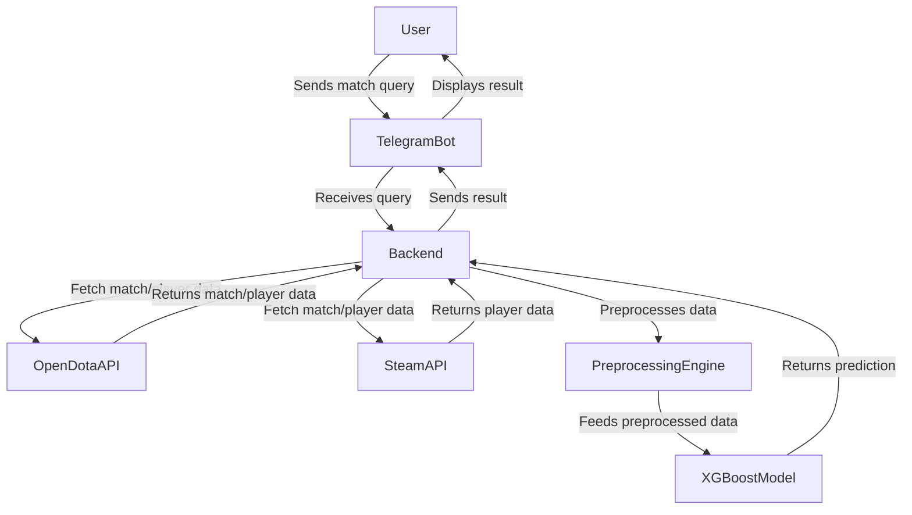
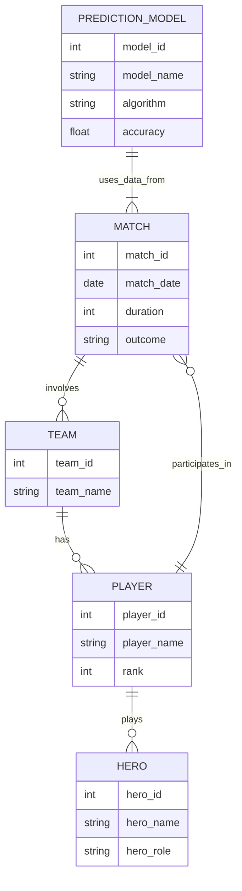

<!-- GitHub badges -->
[](https://github.com/masterhood13/dota2predictor/actions)
[](LICENSE)
[](https://hub.docker.com/r/masterhood13/dota2predictor)
[](https://codecov.io/gh/masterhood13/dota2predictor)
---

# Dota 2 Match Result Predictor Telegram Bot

## Overview

This project is a Telegram bot that leverages a TensorFlow neural network model to predict the outcomes of Dota 2 matches. The bot provides users with real-time predictions based on current match data, making it a useful tool for Dota 2 enthusiasts and analysts.

## Features

- **Real-Time Predictions**: Predict match outcomes using a trained neural network model.
- **Data Integration**:
  - Training data sourced from the **OpenDota API** for historical match results.
  - Current match data fetched using the **Steam API**.
- **User-Friendly Interface**: Interactive Telegram bot interface for easy access to predictions and match information.

## Technologies Used

- **Programming Language**: Python
- **Machine Learning Framework**: TensorFlow
- **APIs**: OpenDota API, Steam API
- **Bot Framework**: python-telegram-bot

## Installation

1. Clone the repository:
   ```bash
   git clone https://github.com/masterhood13/dota2predictor.git
   cd dota2predictor
   ```

2. Install the required dependencies:
   ```bash
   pip install -r requirements.txt
   ```

3. Here’s how your .env file might look:
   ```bash
   OPENDOTA_KEY=your_actual_opendota_api_key
   STEAM_API_KEY=your_actual_steam_api_key
   TELEGRAM_KEY=your_actual_telegram_bot_token
   ```

4. Run the bot:
   ```bash
   python start.py
   ```

## Usage

Once the bot is running, users can interact with it through Telegram to receive predictions for ongoing Dota 2 matches. The bot will provide match details and predicted outcomes based on the trained model.

## High-Level System Schema

Below is a high-level system schema that illustrates how the components interact in the Dota 2 predictor bot:



## Entity-Relationship Diagram (ERD)

Here’s the ERD showing the key entities and their relationships within the system:



## Contributing

Contributions are welcome! Please open an issue or submit a pull request for any enhancements, bug fixes, or new features.

## License

This project is licensed under the MIT License. See the LICENSE file for details.

## Acknowledgments

- [My Medium Article Part 1](https://medium.com/@masterhood13/building-a-dota-2-match-outcome-predictor-my-journey-and-learnings-fd60e1a79a23)
- [OpenDota API](https://docs.opendota.com/)
- [Steam API](https://steamapi.xpaw.me/)
- [PyTorch](https://pytorch.org/)
- [pyTelegramBotAPI](https://pypi.org/project/pyTelegramBotAPI/)

---
