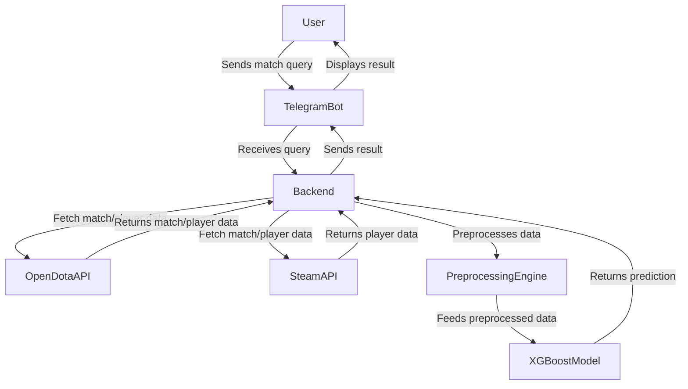
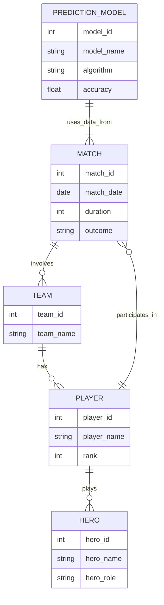

<!-- GitHub badges -->
[](https://github.com/masterhood13/dota2predictor/actions)
[](LICENSE)
[](https://hub.docker.com/r/masterhood13/dota2predictor)
[](https://codecov.io/gh/masterhood13/dota2predictor)
---

# Dota 2 Match Result Predictor Telegram Bot

## Overview

This project is a Telegram bot that leverages a XGBoost neural network model to predict the outcomes of Dota 2 matches. The bot provides users with real-time predictions based on current match data, making it a useful tool for Dota 2 enthusiasts and analysts.

## Features

- **Real-Time Predictions**: Predict match outcomes using a trained neural network model.
- **Data Integration**:
  - Training data sourced from the **OpenDota API** for historical match results.
  - Current match data fetched using the **Steam API**.
- **User-Friendly Interface**: Interactive Telegram bot interface for easy access to predictions and match information.

## Technologies Used

- **Programming Language**: Python
- **Machine Learning Framework**: XGBoost
- **APIs**: OpenDota API, Steam API
- **Bot Framework**: python-telegram-bot

## Installation

### Running the Predictor in Docker Compose

Running the bot with Docker Compose is a great way to manage dependencies and ensure that all services are running consistently across different environments. Here’s how to do it:

1. **Ensure Docker and Docker Compose are Installed**: 
   Make sure you have Docker and Docker Compose installed on your machine.

2. **Prepare Your Project**: 
   Your project directory should contain the following files:
   - `docker-compose.yml`
   - `Dockerfile` for the predictor service
   - Your source code files (including `start.py`)

3. **Create a `.env` File**:
   Ensure you have a `.env` file with your environment variables, including your OpenDota API key, Steam API key, Telegram Bot token, and database credentials.

4. **Build and Run the Services**:
   Open your terminal, navigate to your project directory, and run the following command:
   ```bash
   docker-compose up --build
   ```
   This command will build your predictor image (if necessary) and start both the PostgreSQL database and the predictor bot in separate containers.

5. **Accessing the Bot**:
   Once everything is up and running, you can interact with your Telegram bot as usual.

### Running the Predictor Locally

If you prefer to run the predictor without Docker, you can do so by executing `start.py` directly on your local machine. Here’s how:

1. **Install Required Dependencies**:
   Make sure you have all the required dependencies installed. You can use a virtual environment for this:
   ```bash
   python -m venv venv
   source venv/bin/activate  # On Windows use `venv\Scripts\activate`
   pip install -r requirements.txt
   ```

2. **Set Up PostgreSQL**:
   Ensure you have a PostgreSQL server running. You can install PostgreSQL locally or use a hosted service. Make sure to create a database and user that match the credentials in your `.env` file.

3. **Create a `.env` File**:
   Just like with Docker, you need a `.env` file. It should contain:
   ```plaintext
   OPENDOTA_KEY=your_actual_opendota_api_key
   STEAM_API_KEY=your_actual_steam_api_key
   TELEGRAM_KEY=your_actual_telegram_bot_token
   DB_HOST=localhost
   DB_USER=myuser
   DB_PASSWORD=mypassword
   DB_NAME=mydatabase
   ```

4. **Run the Bot**:
   Now, you can run your bot with:
   ```bash
   python start.py
   ```

5. **Accessing the Bot**:
   Just like with Docker, you can interact with your Telegram bot.

### Summary

- **Docker Compose**: Good for consistency and ease of deployment across different environments. It manages all dependencies, including PostgreSQL, automatically.
  
- **Local Execution**: Useful for development or testing without Docker. Ensure you have all the services running locally.


## Usage

Once the bot is running, users can interact with it through Telegram to receive predictions for ongoing Dota 2 matches. The bot will provide match details and predicted outcomes based on the trained model.

## High-Level System Schema

Below is a high-level system schema that illustrates how the components interact in the Dota 2 predictor bot:



## Entity-Relationship Diagram (ERD)

Here’s the ERD showing the key entities and their relationships within the system:



## Contributing

Contributions are welcome! Please open an issue or submit a pull request for any enhancements, bug fixes, or new features.

## License

This project is licensed under the MIT License. See the LICENSE file for details.

## Acknowledgments

- [My Medium Article Part 1](https://medium.com/@masterhood13/building-a-dota-2-match-outcome-predictor-my-journey-and-learnings-fd60e1a79a23)
- [OpenDota API](https://docs.opendota.com/)
- [Steam API](https://steamapi.xpaw.me/)
- [XGBoost](https://xgboost.readthedocs.io/en/stable/python/python_intro.html)
- [pyTelegramBotAPI](https://pypi.org/project/pyTelegramBotAPI/)

---
